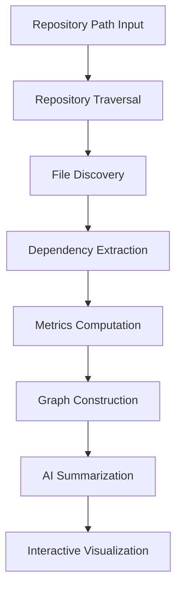
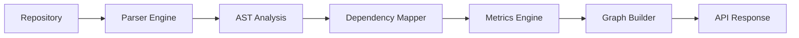
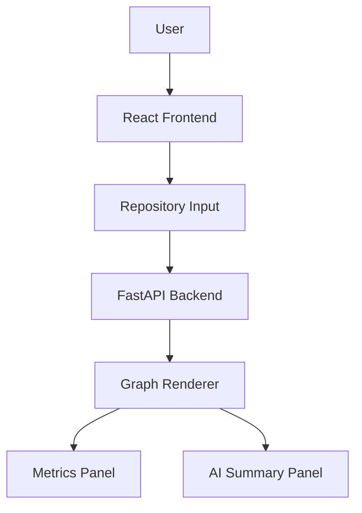
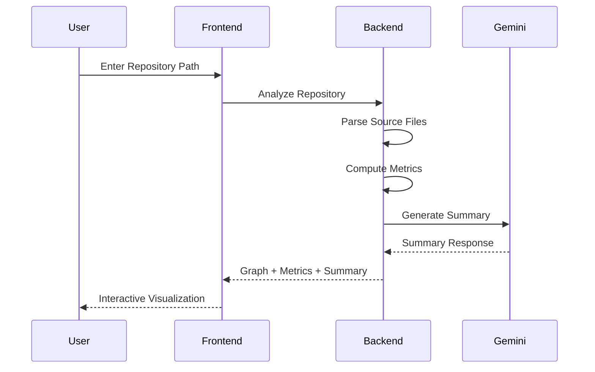

# CodeLens: Repository Structure Analysis & Visualization System

> AI-Powered Repository Analysis, Dependency Visualization, and Intelligent Code Understanding


---

## Overview

CodeLens is an AI-powered repository analysis platform designed to simplify software architecture exploration and accelerate codebase comprehension.

The system automatically traverses source repositories, extracts dependencies, computes software metrics, generates AI-powered summaries, and presents the information through an interactive graph visualization interface.

Whether onboarding to a new project, understanding legacy code, or analyzing software architecture, CodeLens provides developers with actionable insights through graph analytics and intelligent code interpretation.

---

## Key Features

### Interactive Repository Visualization

* Dynamic dependency graph generation
* Interactive node exploration
* Relationship mapping between files
* Visual architecture discovery

### Static Code Analysis

* Lines of Code (LOC) computation
* Complexity estimation
* Structural dependency analysis
* Repository-wide metrics extraction

### AI-Powered Understanding

* Automated file summaries
* Intelligent code explanations
* Context-aware insights
* Rapid repository onboarding

### Modern Web Architecture

* FastAPI backend
* React + Vite frontend
* RESTful API communication
* Real-time visualization

---
## System Workflow



---

## Backend Analysis Pipeline



---

## Frontend Architecture



---

## Component Interaction



---
## Technology Stack

### Frontend

* React
* Vite
* JavaScript
* React Flow

### Backend

* FastAPI
* Python
* Uvicorn

### AI Integration

* Google Gemini API

### Analysis Engine

* Abstract Syntax Tree (AST) Parsing
* Dependency Extraction
* Complexity Analysis
* Graph Construction Algorithms

---

## Project Structure

```text
Repository-Structure-Analysis-and-Visualisation-System
│
├── backend
│   ├── app
│   ├── services
│   ├── core
│   └── requirements.txt
│
├── frontend
│   ├── src
│   ├── components
│   ├── assets
│   └── package.json
│
├── SETUP_GUIDE.md
├── INTEGRATION_ANALYSIS.md
└── README.md
```

---

## System Architecture

```text
Repository
     │
     ▼
Repository Parser
     │
     ▼
Dependency Extraction
     │
     ▼
Metrics Computation
     │
     ▼
Graph Construction
     │
     ▼
AI Summarization
     │
     ▼
Visualization Layer
```

---
## Installation

### Clone Repository

```bash
git clone <repository-url>
cd Repository-Structure-Analysis-and-Visualisation-System
```

---

### Backend Setup

```bash
cd backend/backend
pip install -r requirements.txt
```

Create a `.env` file:

```env
GEMINI_API_KEY=your_api_key_here
```

Run backend server:

```bash
python -m uvicorn app.main:app --reload --port 8000
```

Backend Endpoint:

```text
http://localhost:8000
```

Swagger Documentation:

```text
http://localhost:8000/docs
```

---

### Frontend Setup

```bash
cd frontend
npm install
npm run dev
```

Frontend Endpoint:

```text
http://localhost:5173
```

---

## Usage

1. Launch Backend Server
2. Launch Frontend Application
3. Enter Repository Path
4. Click Analyze
5. Explore Dependency Graph
6. Select Nodes for Metrics & AI Summaries

Example:

```text
E:\Projects\SampleRepository
```

---
## Applications

* Repository Onboarding
* Software Architecture Analysis
* Dependency Visualization
* Technical Documentation Assistance
* Code Review Support
* Educational Software Exploration
* Legacy Codebase Understanding

---

## Future Enhancements

* GitHub Repository URL Analysis
* Additional Language Support
* Architectural Pattern Detection
* Code Smell Identification
* Repository Comparison Engine
* Historical Repository Evolution Tracking
* PDF Architecture Reports
* CI/CD Integration

---

## Performance Highlights

* Fast Repository Traversal
* Interactive Graph Rendering
* AI-Augmented Code Understanding
* Modular System Architecture
* Extensible Analysis Framework

---

## Authors

### Anirudh Karanam

### Gunakala Piyoosh Pranav

### GDSC IIT Roorkee

---

## License

This project was developed as part of technical exploration and innovation initiatives under the GDSC ecosystem.

---

### Built with FastAPI, React, Graph Analytics, and Generative AI.
